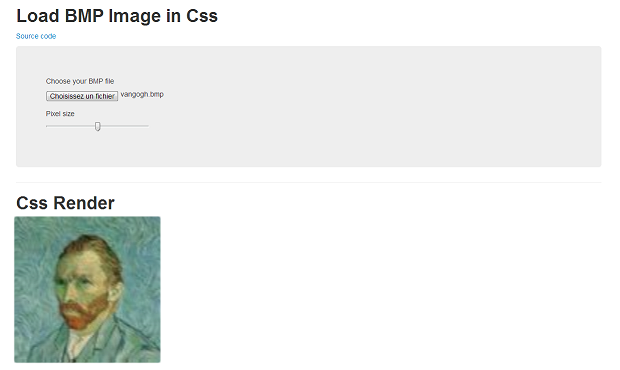

#ImageToCss

Idea inspired by [Mona Lisa css](http://codepen.io/jaysalvat/pen/HaqBf)

##Description

Alpha version.
ImageToCss convert your image to css (BMP only for the time).

##Demo

Try [here](http://nfrancois.github.com/image2css/)

